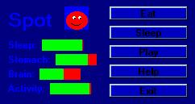



## Spot \(Virutal Pet\) v2\.0 \(UPDATE\)

### Description

a cool little virutal pet that makes noise and is animated.... you can also control what he does. hope you like and PLEASE VOTE AND COMMENT!!!!!

[update 1] i made is so that the sleep button spot to sleep until you woke him up, also when you play with spot he loses food
 
### More Info
 

             |
---                |---
**Submitted On**   |2002-03-20 22:46:44
**By**             |[poop\_4\_brains](https://github.com/Planet-Source-Code/PSCIndex/blob/master/ByAuthor/poop-4-brains.md)
**Level**          |Intermediate
**User Rating**    |5.0 (10 globes from 2 users)
**Compatibility**  |VB 6\.0
**Category**       |[Games](https://github.com/Planet-Source-Code/PSCIndex/blob/master/ByCategory/games__1-38.md)
**World**          |[Visual Basic](https://github.com/Planet-Source-Code/PSCIndex/blob/master/ByWorld/visual-basic.md)
**Archive File**   |[Spot\_\(Viru639683202002\.zip](https://github.com/Planet-Source-Code/poop-4-brains-spot-virutal-pet-v2-0-update__1-32895/archive/master.zip)

